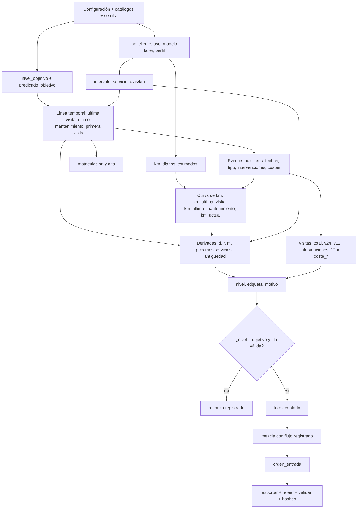

# Hito 1 · Diseño de los datos — Postventa (Laboratorio 1)

Ficheros asociados: `diccionario_datos.json` (50 columnas) y `configuracion_generacion.json` (propuesta).
Todo es **sintético**; umbrales, intervalos, pesos y distribuciones son decisiones docentes, no datos de Mercedes-Benz.

## 1. Decisiones de alcance

| Decisión | Valor |
|---|---|
| Unidad de observación | 1 caso pendiente por vehículo a fecha de corte; 1 cliente por vehículo (núcleo) |
| Fecha de corte | 2026-06-30 (fija, nunca el reloj) |
| Tamaños | desarrollo 1.000 · balanceado 100.000 · desbalanceado 100.000 · (opcional 1.000.000) |
| Cuotas balanceado | 20.000 por nivel (dev: 200) |
| Cuotas desbalanceado (1,2,3,6,8) | 5.000 / 10.000 / 15.000 / 30.000 / 40.000 (dev: 50/100/150/300/400) |
| Historial | se generan **eventos auxiliares** y se agregan; máx. 1 evento por día |
| Primera visita | siempre de tipo `mantenimiento` (garantiza que exista un último mantenimiento ≥ primera visita) |
| Intervenciones | ≥ 1 por visita, por tanto `intervenciones_12m ≥ visitas_12m` |
| Ventanas | anual `[0,365)`, bianual `[0,730)` |

## 2. Qué se muestrea y qué se calcula

| Grupo | Columnas |
|---|---|
| **Constantes** | `fecha_corte`, `escenario`, `origen_dato`, `version_reglas`, `estado_caso` |
| **Muestreadas** | `id_*`, `tipo_cliente`, `canal_preferido`, `modelo`, `id_taller` |
| **Muestreadas condicionadas** | `combustible`, `transmision`, `uso_vehiculo`, `km_diarios_estimados`, `intervalo_servicio_*`, `tipo_ultima_visita`, fechas base (`fecha_ultima_visita`, `fecha_ultimo_mantenimiento`, `fecha_primera_visita`, `fecha_matriculacion`, `fecha_alta_cliente`), bloque de contacto |
| **Catálogo (sin sorteo)** | `carroceria` (← modelo), `zona_geografica` (← taller) |
| **Calculadas (nunca se resamplean)** | recuentos y costes (agregando eventos), `km_*`, las 8 derivadas de §3.5, `nivel_prioridad`, `etiqueta_prioridad`, `motivo_prioridad`, `orden_entrada` |
| **Internas del generador (no se exportan)** | `nivel_objetivo`, `predicado_objetivo`, `perfil_actividad`, `historial_eventos` |

Las **cuatro señales** que deciden el nivel son `dias_sin_visita` (d), `retraso_servicio_dias` (r), `exceso_km_servicio` (m) y `visitas_12m` (v). Nada más entra en la función.

## 3. Grafo de dependencias



**Orden de generación** (resumen de la guía §4): configuración → cobertura/catálogos → perfiles → línea temporal y eventos → derivadas → etiqueta y cuota → mezcla y `orden_entrada` → exportar y releer.

## 4. Estrategia de muestreo guiada por intervalos

Se elige el nivel objetivo (con cuota pendiente) y un predicado objetivo, y se muestrea **dentro del intervalo** que lo permite. El nivel final se **calcula**; si no coincide, se rechaza (el objetivo guía, la regla decide).

| Nivel | Predicado objetivo | Intervalos de señales |
|---|---|---|
| 1 | `n1_inactividad` | d ∈ [730, 1500] (v = 0 implícito) |
| 1 | `n1_retraso` | r ∈ [180, 900] |
| 1 | `n1_exceso_km` | m ∈ [10000, 60000] |
| 2 | `n2_inactividad` | d ∈ [540, 730), r<180, m<10000 |
| 2 | `n2_sin_visitas` | d ∈ [365, 540), r<180, m<10000 |
| 2 | `n2_retraso` | r ∈ [90, 180), d<730, m<10000 |
| 2 | `n2_exceso_km` | m ∈ [5000, 10000), d<730, r<180 |
| 3 | `n3_retraso` | d<365, r ∈ [30, 90), m<5000 |
| 3 | `n3_exceso_km` | d<365, m ∈ [2000, 5000), r<90 |
| 4 | `n4_inactividad` | d ∈ [180, 365), r<30, m<2000 |
| 4 | `n4_retraso` | d<365, r ∈ [1, 30), m<2000 |
| 4 | `n4_exceso_km` | d<365, m ∈ [1, 2000), r<30 |
| 4 | `n4_una_visita` | v = 1, d<365, r<30, m<2000 |
| 5 | `sin_condicion` | d<180, r=0, m=0, v ≥ 2 |

**Cómo se consiguen r y m sin sortearlas:** `r = max(0, días_desde_mantenimiento − intervalo_días)` y `m = max(0, km_desde_mantenimiento − intervalo_km)`. El generador elige la fecha del último mantenimiento y el intervalo; los km salen de la curva de acumulación (segmentos entre eventos con `días × km_diarios × U(0.8,1.2)`, acumulados, por tanto monótonos).

**Acoplamientos que hay que explicar en el informe:**
- r y m crecen con el tiempo desde el último mantenimiento, así que están correlacionadas por construcción.
- Un último evento de tipo `mantenimiento` pone `días_desde_mantenimiento = d`. Para tener un retraso grande con visita reciente, el último evento debe ser `reparacion` o `revision`; por eso `tipo_ultima_visita` depende del predicado objetivo.
- Nivel 5 exige `m = 0` con `días_desde_mantenimiento ≤ intervalo_días`. Con uso profesional (≈95 km/día) e intervalo S1 (180 d / 10.000 km) esto es casi imposible. **Efecto esperado:** nivel 5 sobrerrepresenta intervalos largos y usos bajos. Se documentará como concentración del generador, no como hallazgo.

## 5. Redundancias de la política `postventa_v1` (a documentar)

Para casos coherentes, `d ≥ 365 ⇔ v = 0`, y eso domina varias condiciones:

- `d ≥ 540` (nivel 2) está dominada por `v = 0`, pero se evalúa antes y fija el motivo `n2_inactividad`.
- `d ≥ 365` (nivel 3) está **dominada**: cualquier caso con d ≥ 365 ya cumple `v = 0` en nivel 2. `n3_inactividad` es inalcanzable en datos coherentes. Lo comprobará el informe (0 casos).
- `n4_inactividad` (d ≥ 180) solo se alcanza con d ∈ [180, 365) y v ≥ 1.
- No es ambiguo: las filas se evalúan en orden y gana la primera; dentro de un nivel, el orden es inactividad → retraso → exceso km → frecuencia.

## 6. Distribuciones previstas

| Variable | Diseño | Justificación |
|---|---|---|
| Identificadores | enteros únicos sin reemplazo, mezcla posterior | no codifican nivel ni orden |
| `tipo_cliente` | 0.70 / 0.15 / 0.15 | mayoría particular; todas las categorías presentes |
| `uso_vehiculo` | condicionado por tipo (tabla en config) | relación declarada como supuesto |
| `km_diarios_estimados` | lognormal truncada por uso (medianas 28/45/70/95) | asimetría positiva sin recortar a cero |
| `modelo`, `id_taller` | categórica con pesos no uniformes (todos ≥ 5 %) | cobertura sin exigir uniformidad |
| `combustible`/`transmision` | dentro de combinaciones del catálogo | no se permiten combinaciones imposibles |
| Intervalos de servicio | catálogo S1–S4 por combustible | ficticios, documentados |
| Antigüedad | se obtiene de la línea temporal (primera visita + gap de matriculación) | evita fechas independientes |
| Costes | lognormal truncada por tipo de visita | no negativos y asimétricos |
| Visitas extra | Poisson acotado por el hueco temporal | recuentos realizables |
| Contacto | 20 % sin contacto; resto con respuesta categórica | contexto, no entra en la prioridad |

Las distribuciones **observadas** tras cuotas y rechazo se medirán y compararán con estas en el informe (efecto de las cuotas).

## 7. Riesgos y decisiones abiertas

1. **Tasa de rechazo** en niveles 5 y 3 con usos intensivos. Mitigación: intervalos previos y límite de 200 intentos por fila.
2. **`km_actual ≤ 350.000`** puede truncar vehículos antiguos de uso profesional. Se registra como rechazo.
3. **Eventos solo auxiliares**: el informe dirá que los resúmenes proceden de eventos generados, pero estos no se publican en el dataset grande.
4. Confirmar con el profesor: ¿vale `orden_entrada` en 1..N (el modelo dice "no negativo")? Se propone 1..N.
5. Confirmar si la ampliación multivehículo queda fuera (se propone **fuera**).

## 8. Dependencias de software

`python ≥ 3.11`, `numpy`, `pandas`, `matplotlib`, `pytest`, `jupyter`; opcional `pyarrow`. Estándar: `hashlib`, `json`, `time`, `datetime`. Prohibido en la parte de estructuras: `heapq`, `PriorityQueue`. Versiones y algoritmo de aleatoriedad (PCG64) se vuelcan automáticamente a `informe_calidad.json`.

## 9. Estructura propuesta del repositorio

```
docs/            diccionario_datos.json, configuracion_generacion.json, DISENO.md
src/generador/   catalogos.py, perfiles.py, eventos.py, derivadas.py, cuotas.py, exportar.py
src/validacion/  etiquetador_referencia.py (independiente del generador), validador.py, hashes.py
src/estructuras/ monticulo.py, lista_sin_ordenar.py   (Hito 3)
data/            desarrollo/  pruebas/  grande/ (CSV.gz, fuera de git o con LFS)
tests/           test_etiquetas.py, test_coherencia.py, test_errores.py
notebooks/       Laboratorio1_Mercedes_Grupo.ipynb
requirements.txt
```

## 10. Reparto inicial de tareas (plantilla para 4 personas; ajustar nombres)

| Rol | Responsable | Hito 1 | Hito 2 | Hitos 3–4 |
|---|---|---|---|---|
| A · Datos y esquema | _por asignar_ | diccionario, catálogos, config | catálogos en código, lectura con dtypes | tablas y representación del registro |
| B · Generador | _por asignar_ | grafo y estrategia de intervalos | perfiles, eventos, cuotas, rechazos | muestras reproducibles por tamaño |
| C · Etiquetado y validación | _por asignar_ | análisis de redundancias | **etiquetador de referencia independiente**, validador, pruebas frontera/errores | montículo + equivalencia con lista |
| D · Informe e integridad | _por asignar_ | estructura del repo, dependencias | informe de calidad, gráficos, SHA-256 | experimentos, gráficos, notebook |

**Regla de revisión cruzada:** quien escribe el generador (B) no escribe el etiquetador de referencia (C); cada PR lo revisa otra persona.

## 11. Antes del Hito 2: predicciones a anotar

Cada miembro escribe, **antes de ejecutar**, qué ocurre con el nivel si: (a) se resta 1 día a `fecha_ultima_visita` en d = 729; (b) se sube `intervalo_servicio_km` de 15.000 a 20.000 con m = 2.500; (c) un caso con d = 400 recibe `visitas_12m = 1` (debe rechazarse por R14).
